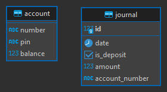

# How to Setup
1. Clone this repository.
2. Copy the `.env.example` file to `.env` and fill in the required environment variables.
3. Run `docker-compose -f ./deployments/docker-compose.yaml --env-file .env up -d` to start the server.

## Step to test API

1. Install Postman
2. Open Postman and import the [collection](postman_collection.json)
3. Setup at `base_url` environment variables postman collection
4. Register new account at `pendaftaran rekening baru` /daftar
5. Configure Authorization (username `no_rekening` and password `pin`) at postman collection
6. Run another endpoint

## Tech Stack

- Language: Go
- Framework: Fiber
- Database: Postgres, Redis
- ORM: Gorm, Redis Client
- Hashing: Bcrypt
- Tracing: OpenTelemetry
- Logging: Logrus

## Features

- Create a new account
- Deposit
- withdrawal

## ERD

